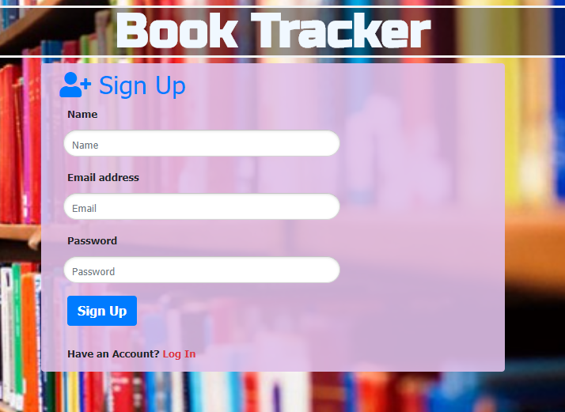
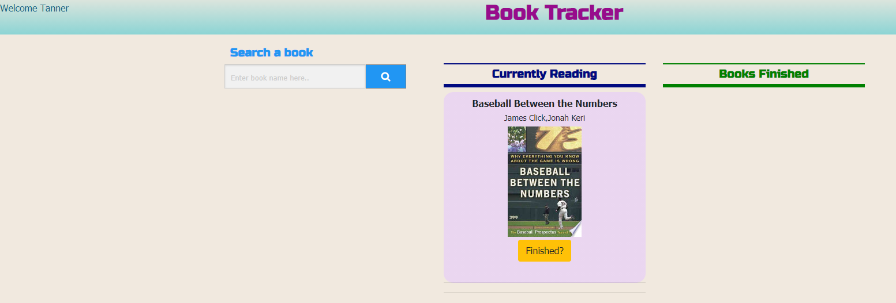
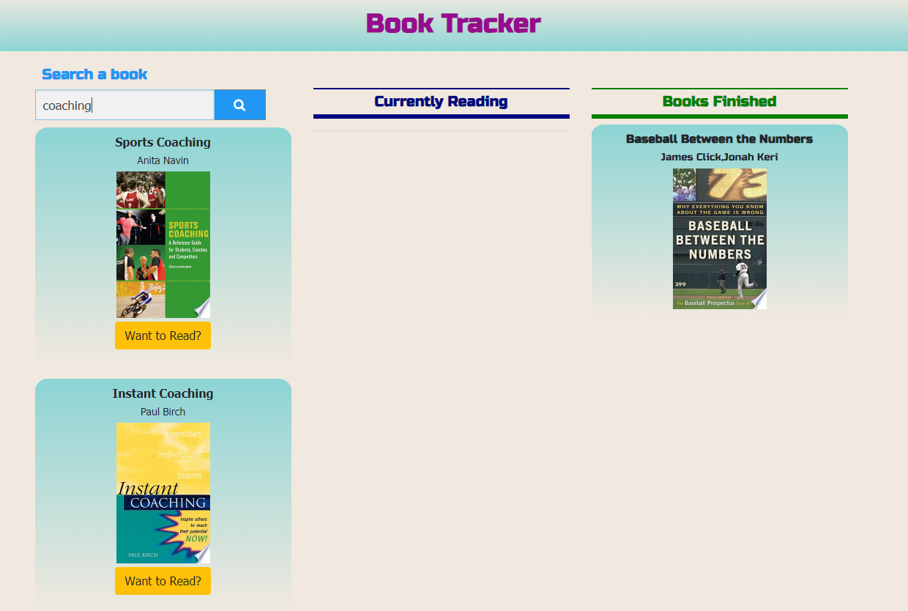

# Book Tracker App

The Book Tracker app is a helpful tool for tracking books that you are currently reading and have finished reading.

# Contents
1. [User Story](#user-story)
2. [Usage](#usage)
3. [Built With](#built-with)

## User Story

As savvy reader, I’m in need of a place where I can track my reading. I need to know what I am currenly reading and what I have already read. As well as should be able to search books that I want to read. 

Deployed website can be found at [this link](https://book-trackerapp.herokuapp.com/).

## Usage 
When first entering the site, user is able to sign up or log in. If new user, they can sign up and if the user is existing user, they can log in.

Once logged in, the main page appears with option to search for a book, mark it as Want to Read and Finished reading.

## Built With

APIs:
- [Google Books API]- Pulls in Title, Author and Image of the book searched

Technologies Used:
- [Node]
- [Express] 
- [MySQL] 
- [Handlebars] 
- [Javascript] 
- [JQuery] 
- [TravisCI] 

## Contributers
    Tanner Nielsen
    Devin Payton
    Sumnima Bhandari
    Sumnima
